# <div align = center>User Interface for [NEVIRAIDE](https://github.com/RAprogramm/NEVIRAIDE)</div>

<!--toc:start-->

 <h2 id="table-of-contents" align="center">Table of Contents</h2>

<ul>
    <li>
        <a href="#features">Features</a>
    </li>
    <li>
        <a href="#installation">Installation</a>
    </li>
    <li>
        <a href="#dependencies">Dependencies</a>
        <ul>
            <li>
                <a href="#optional-dependencies">Optional dependencies</a>
                <ul>
                    <li>
                        <a href="#icons">Icons</a>
                    </li>
                </ul>
            </li>
        </ul>
    </li>
    <li>
        <a href="#overview">Overview</a>
    </li>
    <li>
        <a href="#usage">Usage</a>
        <ul>
            <li>
                <a href="#dashboard-command">Dashboard Command</a>
            </li>
            <li>
                <a href="#ui-command">UI Command</a>
                <ul>
                    <li>
                        <a href="#examples">Examples</a>
                    </li>
                </ul>
            </li>
        </ul>
    </li>
    <li>
        <a href="#autocompletion">Autocompletion</a>
    </li>
    <li>
        <a href="#themes">Themes</a>
        <ul>
            <li>
                <a href="hyprland-themes">Hyprland themes</a>
            </li>
        </ul>
    </li>
</ul>

<!--toc:end-->
<hr>

## Features

Lightweight &amp; performant ui plugin for NEVIRAIDE providing:

<table><td><br>

> #### **_<div align="right">Dashboard (startup screen)</div>_**
>
> 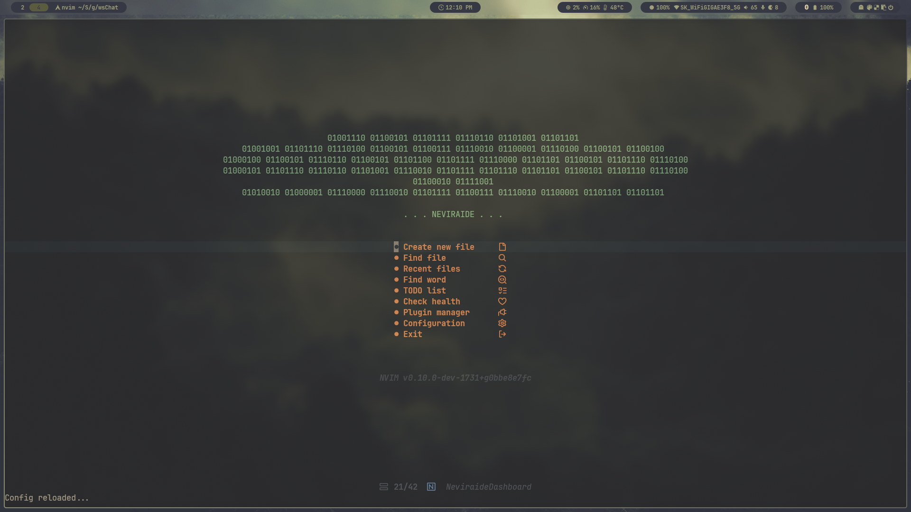<br><br>

<hr>

> #### **_<div align="right">Statusline</div>_**
>
> 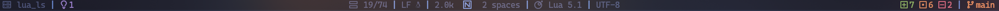<br><br>

<hr>

> #### **_<div align="right">Buffers and tabs line</div>_**
>
> <br><br>

<hr>

> #### **_<div align = right>Hyprland themes sync_**
>
> https://github.com/RAprogramm/neviraide-ui.nvim/assets/70325462/dc8a63ac-c632-41f4-beec-7e10602dcfae

</td></table>

## Installation

_Install neviraide-ui using your favorite plugin manager. For example, with [lazy.nvim](https://github.com/folke/lazy.nvim):_

```lua
require('lazy').load({
    plugins = {
      {
        'RAprogramm/neviraide-ui.nvim',
        name = 'UI',
        event = 'VeryLazy',
        opts = {
            hyprTheme = true -- to sync NEVIRAIDE colorschemes with Hyprland
        },
        config = function(_, opts) require('neviraide-ui').setup(opts) end,
        dependencies = {
          {
            'rcarriga/nvim-notify',
            opts = function() return require('plugins.ui.notify.options') end,
            init = function()
              require('neviraide.utils').on_very_lazy(
                function() vim.notify = require('notify') end
              )
            end,
          },
        },
      },
    }
})
```

_Reload your Neovim configuration or restart Neovim._

_After this, neviraide-ui will be automatically downloaded, installed, and configured for you._

## Dependencies

- [plenary](https://github.com/nvim-lua/plenary.nvim)

### Optional dependencies

> - #### Icons
>
> _For display [nonicons](https://github.com/yamatsum/nonicons) instead of [devicons](https://github.com/vorillaz/devicons) run in your terminal:_
>
> ```sh
> yay -S nonicons-git
> ```
>
> _add this `symbol_map U+f101-U+f25c nonicons` to your kitty config._

## Overview

> _The code establishes commands in Neovim to control various aspects of the neviraide-ui plugin. The commands available are:_

- `Dashboard`: Toggles between displaying and hiding the dashboard.

- `UI`: A versatile command with various sub-commands to control UI settings:
  - `borders`: Sets border styles.
  - `numbers`: Toggles, enables, or disables line numbers.
  - `relative_numbers`: Toggles, enables, or disables relative line numbers.
  - `cursor_line`: Toggles, enables, or disables the cursor line.
  - `cursor_column`: Toggles, enables, or disables the cursor column.
  - `transparency`: Toggles, enables, or disables the transparency.
  - `theme`: Changes the theme.
  - `indents`: Sets the indent size.

## Usage

### Dashboard Command:

```vim
:Dashboard
```

> _Use this command to toggle the dashboard display on and off._

### UI Command:

```vim
:UI [sub-command] [argument]
```

> Sub-commands include:
>
> - borders with arguments like 'none', 'rounded', etc.
> - theme with available theme names as arguments.
> - numbers, relative_numbers, cursor_line, cursor_column, and transparency with arguments 'toggle', 'enable', or 'disable'.
> - indents with the indent size as an argument.

#### Examples:

To change the borders to rounded:

```vim
:UI borders rounded
```

To enable line numbers:

```vim
:UI numbers enable
```

To change the theme:

> INFO: themes option not available if `hyprTheme = true` in config.

```vim
:UI theme [theme_name]
```

To set the indent size to 4:

```vim
:UI indents 4
```

## Autocompletion

> The UI command also supports autocompletion, which means you can press <TAB> and get suggestions to complete it. The same applies to the arguments of each sub-command.

## Themes

### Hyprland themes

[](#-Catppuccin-Mocha)
[](#-Catppuccin-Latte)
[](#-Decay-Green)
[](#-Rosé-Pine)
[](#-Tokyo-Night)<br>
[](#-Material-Sakura)
[](#-Graphite-Mono)
[](#-Cyberpunk-Edge)
[](#-Frosted-Glass)
[](#-Gruvbox-Retro)

</div><br><table><td><br>

> #### **_<div align = right>// Catppuccin-Mocha</div>_**
>
> 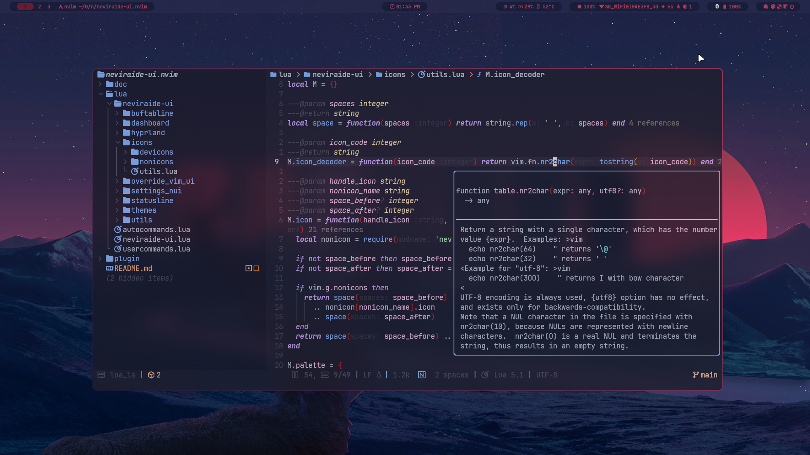 <br><br>

<hr>

> #### **_<div align = right>// Catppuccin-Latte</div>_**
>
> 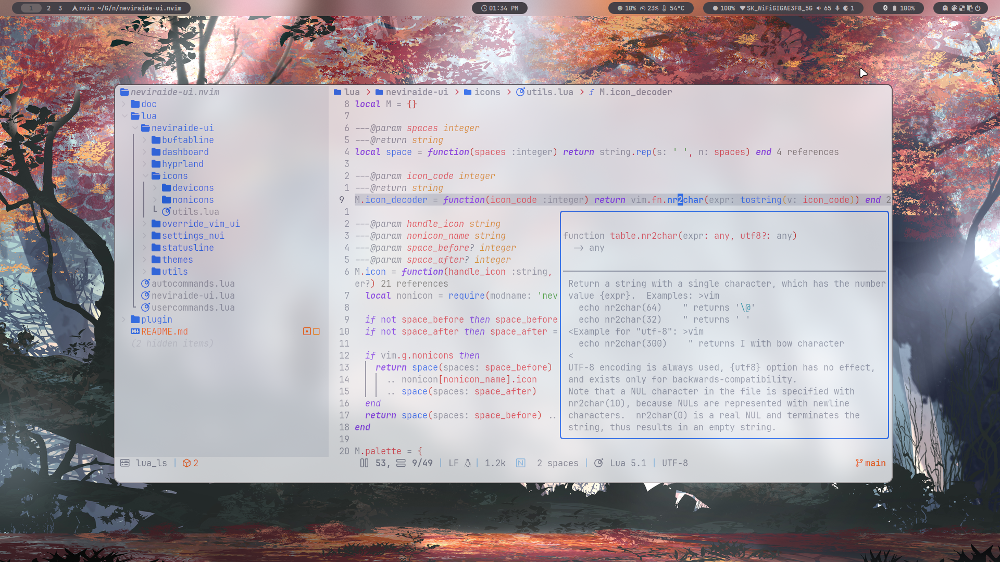<br><br>

<hr>

> #### **_<div align = right>// Decay-Green</div>_**
>
> 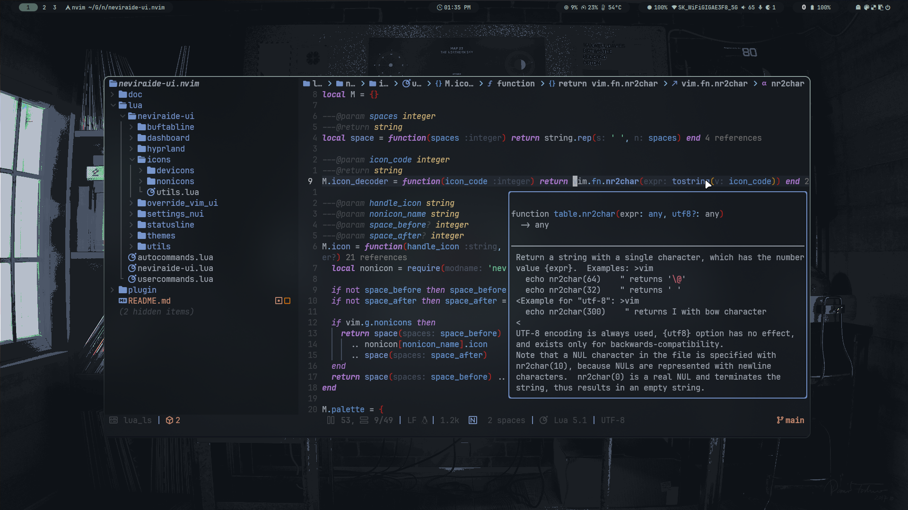<br><br>

<hr>

> #### **_<div align = right>// Rosé-Pine</div>_**
>
> 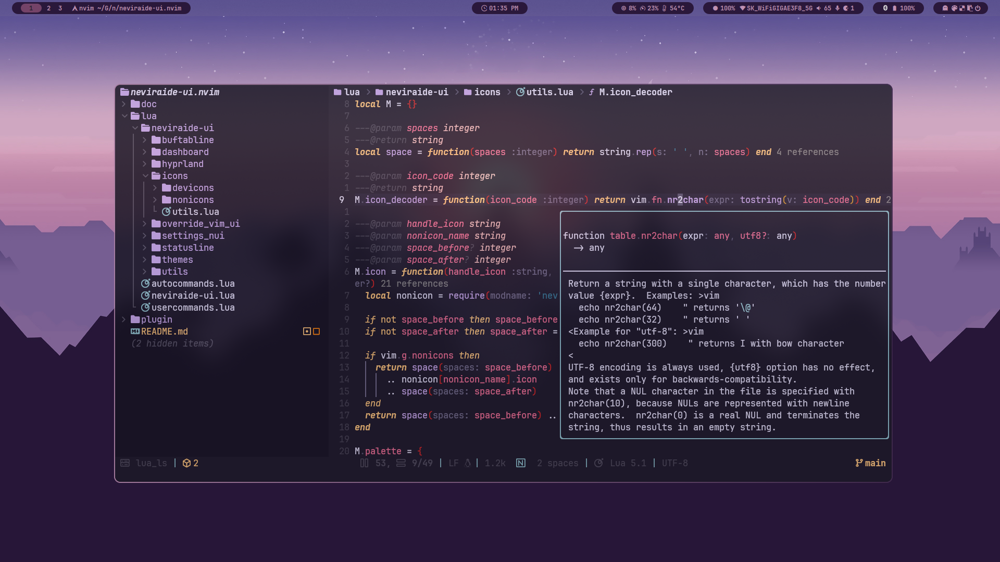<br><br>

<hr>

> #### **_<div align = right>// Tokyo-Night</div>_**
>
> 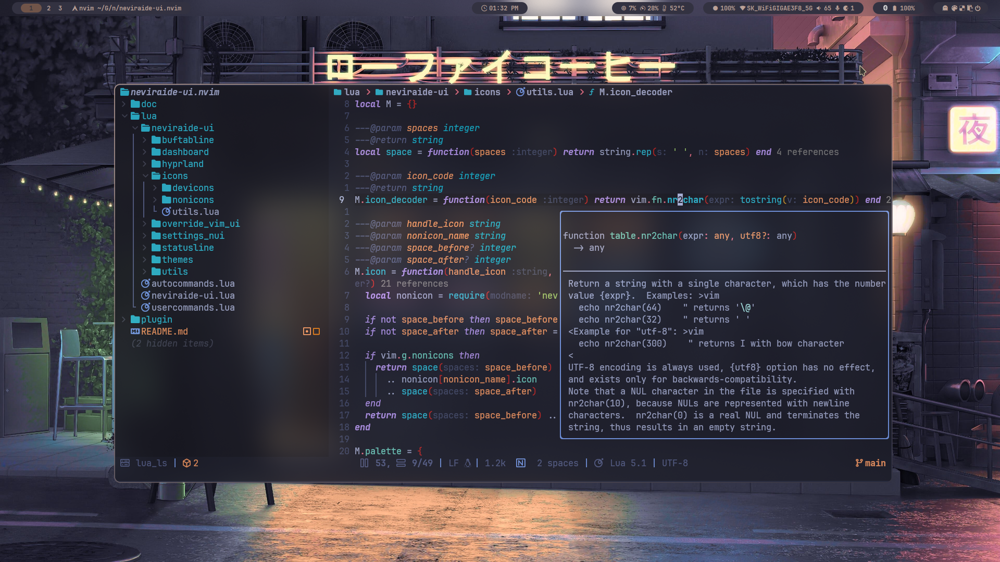<br><br>

<hr>

> #### **_<div align = right>// Material-Sakura</div>_**
>
> 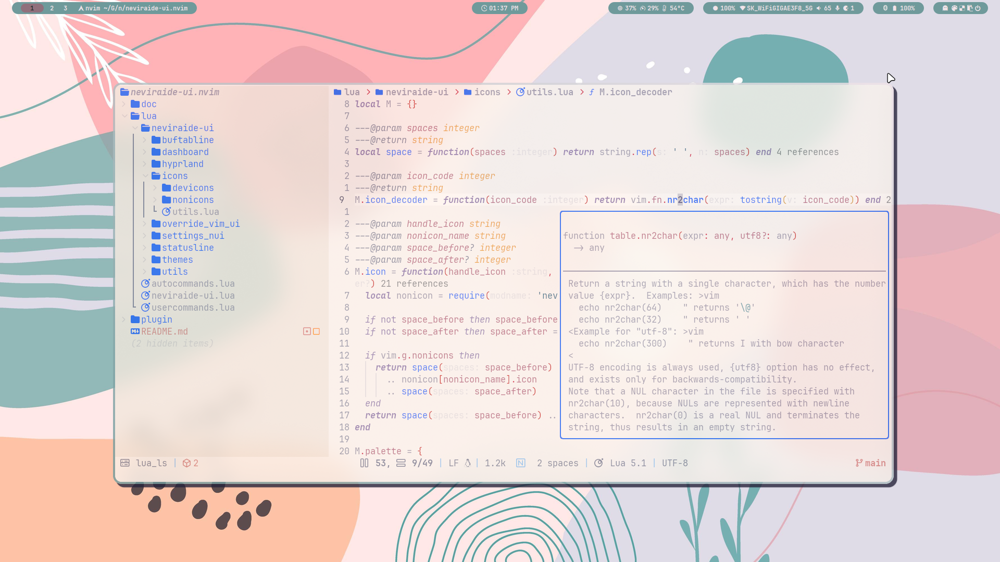<br><br>

<hr>

> #### **_<div align = right>// Graphite-Mono</div>_**
>
> 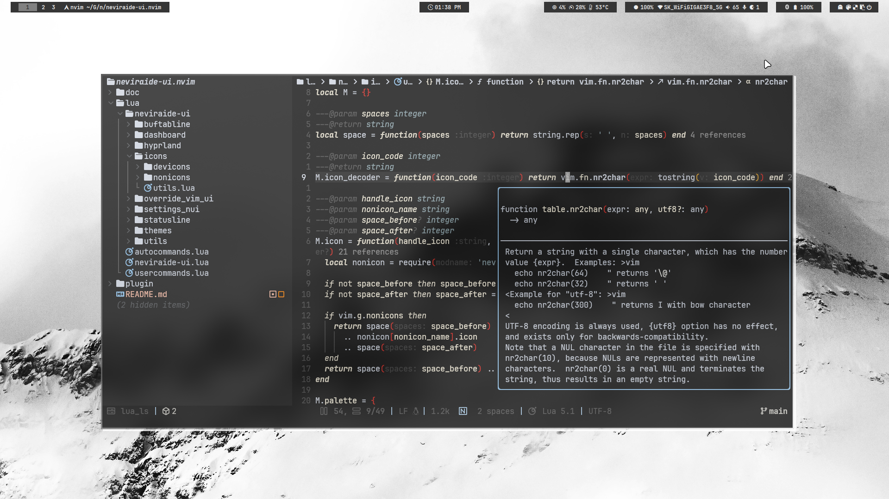<br><br>

<hr>

> #### **_<div align = right>// Cyberpunk-Edge</div>_**
>
> 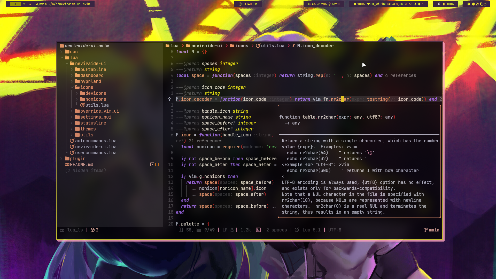<br><br>

<hr>

> #### **_<div align = right>// Frosted-Glass</div>_**
>
> 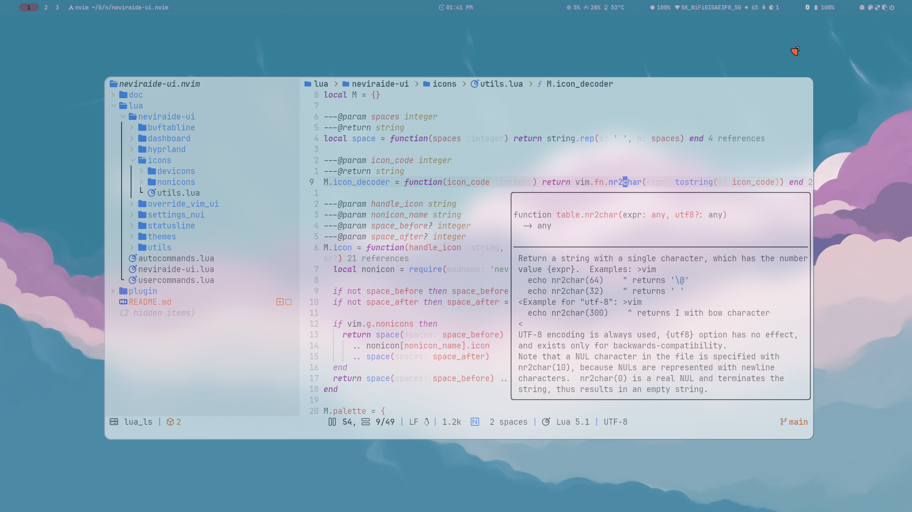<br><br>

<hr>

> #### **_<div align = right>// Gruvbox-Retro</div>_**
>
> 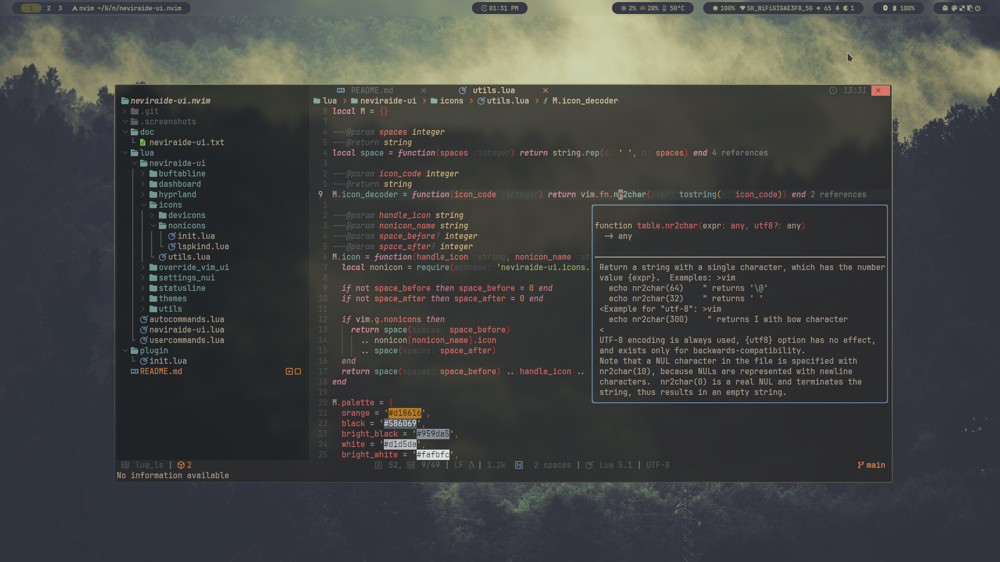

<hr>

</td></table>

### Standalone themes

<table><td><br>

> #### **_<div align = right>// Chocolate</div>_**

<!-- >  <br><br> -->

<!-- <td>Chocolate</td> -->
<!-- <td>Dracula</td> -->
<!-- <td>Everforest</td> -->
<!-- <td>Gruvbox Light</td> -->
<!-- <td>Kanagawa</td> -->
<!-- <td>Nord</td> -->
<!-- <td>One Dark</td> -->
<!-- <td>Sweet Pastel</td> -->
<!-- <td>VSCode</td> -->

<hr>
    </td>
</table>

<div align = right> <br><br>

[<kbd> <br> 🡅 <br> </kbd>](#table-of-contents)

</div>
